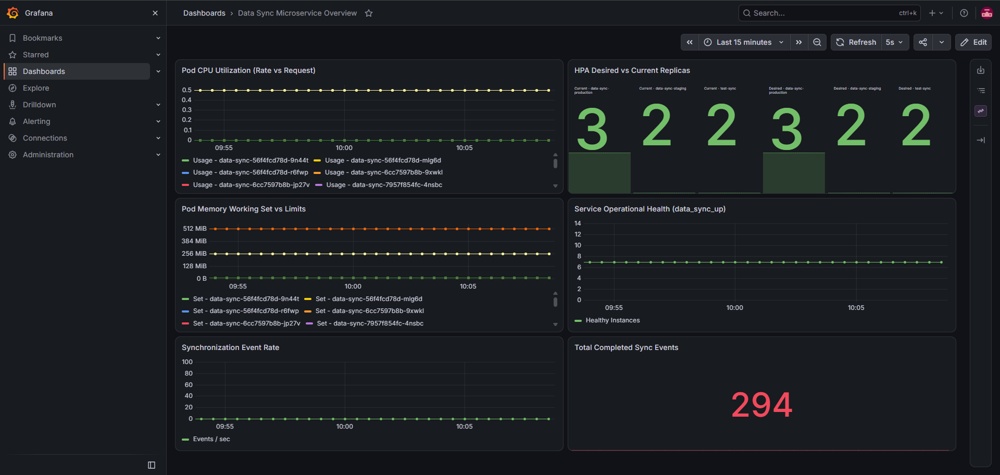
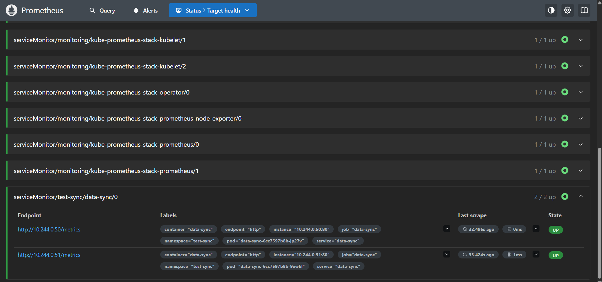

# data-sync — DevOps Assignment Submission

Production-grade Kubernetes packaging, infrastructure automation, and observability scaffolding for the `data-sync` microservice.

## What's Here

| Part | Location | What it is |
|---|---|---|
| **Part 1 — Helm Chart** | `helm/charts/data-sync/` | Deployment, Service, HPA, ConfigMap, Secret, PDB, and ServiceMonitor with layered values files. |
| **Part 1 — Kustomize Overlay** | `standard/data-sync/production/` | Zone topology spread constraints and secret checksum patching applied over rendered production manifests. |
| **Part 2 — Ansible Automation** | `ansible/roles/be-data-sync/`, `ansible/playbooks/`, `ansible/group_vars/` | Automated provisioning and systemd unit management for CentOS/Rocky 8 VM workloads in the `service` host group. |
| **Part 3 — Design Document** | `DESIGN.md` | Scaling, noisy-neighbor isolation, and zero-downtime secret rotation. |
| **Artefact 1 — Trade-offs** | `TRADEOFFS.md` | Technical alternatives, trade-offs, and design rationale. |
| **Artefact 2 — Architecture** | `ARCHITECTURE.md` | Architectural flow, NFR compliance, operational lifecycle, and repository maintenance. |
| **Observability Artifacts** | `monitoring/screenshots/`, `monitoring/dashboards/` | Grafana dashboard and Prometheus target screenshots, plus the exportable dashboard JSON. |

## Verification Commands

```bash
cd helm/charts/data-sync
helm lint . -f values.yaml -f values.staging.yaml
helm lint . -f values.yaml -f values.production.yaml
helm template data-sync . -f values.yaml -f values.staging.yaml > /dev/null
helm template data-sync . -f values.yaml -f values.production.yaml > /dev/null

cd ../../..

ansible-playbook ansible/playbooks/playbook-data-sync.yml --syntax-check
ansible-lint ansible

# Render and validate the production Kustomize overlay. The script updates the
# SECRET_CHECKSUM patch from the rendered Secret on every run.
bash standard/data-sync/production/render.sh
kubectl kustomize standard/data-sync/production > /dev/null

[ -f "monitoring/screenshots/dashboard.png" ] && echo "Grafana dashboard screenshot present"
[ -f "monitoring/screenshots/prometheus-targets.png" ] && echo "Prometheus targets screenshot present"
[ -f "monitoring/dashboards/data-sync-overview.json" ] && echo "Dashboard JSON present"
```

## Observability and Runtime Scaffolding

The chart mounts a custom Nginx virtual configuration into the `nginx:1.27-alpine` runtime stand-in:

- `/health` returns HTTP 200 with `{"status":"ok"}` for liveness and readiness probes.
- `/metrics` returns Prometheus exposition text with sample `data_sync_up` and `data_sync_events_total` metrics.

This allows the Kubernetes and observability wiring to be validated without building an application image. Replace the image and port settings with the production FastAPI image before a real deployment.

### Runtime port contract

The assignment's application listens on port `8080`. The Nginx stand-in also
listens on `8080`, so the Service, container, probes, and eventual FastAPI
image all use the same port contract. Replace the image when the real service
image is available:

```yaml
image:
  repository: your-registry/data-sync
  tag: v1.0.0
```

### Secret checksum strategy

Direct Helm releases use the `checksum/secret` annotation in
`templates/deployment.yaml`; Helm recalculates it whenever the rendered Secret
changes. The production Kustomize workflow has a second, explicit
`SECRET_CHECKSUM` annotation. `standard/data-sync/production/render.sh`
extracts the rendered Secret, calculates its SHA256 digest, and updates the
Kustomize patch before applying the overlay. This keeps both deployment paths
rolling on a password change without committing a real password.

For a real production render, provide the password only through the process
environment; the script passes it to Helm without writing it to a values file:

```bash
REDIS_PASSWORD="$REDIS_PASSWORD" bash standard/data-sync/production/render.sh
```

### Verification Screenshots

The captured screenshots show the monitoring results from the deployed configuration:





The dashboard export used to create the Grafana view is available at `monitoring/dashboards/data-sync-overview.json`.

## Architectural Conventions

- `nginx:1.27-alpine` is used as a lightweight runtime stand-in until the FastAPI image is available.
- Redis is an external or managed dependency; production can use the Bitnami Redis sub-chart or a managed service.
- Secret values are structural placeholders only. Inject real credentials through External Secrets Operator or CI deployment flags, never from git.
